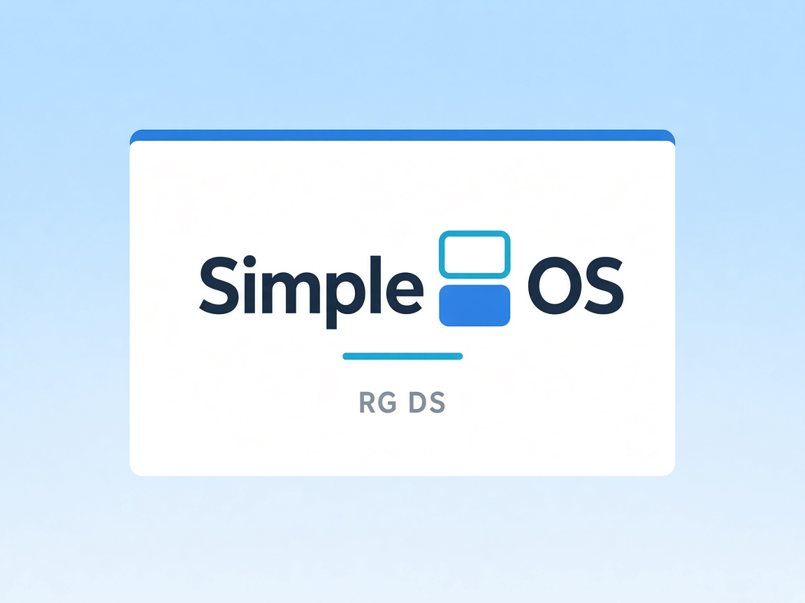

  

# SimpleOS

**Nintendo DS** focused cfw for the [Anbernic RG DS](https://anbernic.com/).
It features a DS-style home menu that supports both screens, and a simple in-game menu.
Inspired by [Shauninman's](https://github.com/shauninman)
[Dedicated OS](https://github.com/dedicated-os/dedicated-zero40)
for the MagiXZero40. 

This is **not** a fully fledged OS built from the ground up. It lays upon Anbernic's Linux OS.
DraStic and Nintendo BIOS files are **not** distributed here; SimpleOS uses the
copies already present on official Anbernic Linux.

## Purpose

SimpleOS replaces the multi-system frontend with a DS-only shell:

1. **Fast start**
2. **DS library only** — `.nds` / `.dsi` / `.zip`. No other systems at runtime.
3. **DSi-like UI** 
4. **In-game menu**

## Installation

Latest package: [`releases/SimpleOS-RGDS-20260908.zip`](https://github.com/boorngos/SimpleOS/releases/tag/V1.0-SimpleOS)

1. Flash official Anbernic Linux on the TF card.
2. On a PC, open the user partition (the one with `Roms/`).
3. Extract the zip **into that directory** (merge `Roms/` if Windows asks).
4. Boot the RG DS
5. Go into **APPS → Install SimpleOS**.
6. Wait until the process is finished
7. The handheld reboots into SimpleOS.
8. If the top screen doesn't show up, click **start** → **reboot** 

Full steps, updates, and how to return to Anbernic stock OS:
**[docs/INSTALL.md](docs/INSTALL.md)**

## Controls

| Action | Control |
| --- | --- |
| Open / close in-game menu | **Home/Back** |
| Change title in the menu | **L** / **R** (D-pad left / right) |
| Fast-forward | **Anbernic** + **SELECT** |
| Load / save state | **Anbernic** + **L2** / **R2** |
| Microphone| **R3**|
| Toggle FPS | **Anbernic** + **X** |
| Brightness | **Anbernic** + **L1** / **R1** |
| Sleep | Tap **POWER** or close the lid |
| Power off | Hold **POWER** |

Complete tables for home, options, and in-game:
**[docs/CONTROLS.md](docs/CONTROLS.md)**

## Credits
[MechanicalDragon0687](https://github.com/MechanicalDragon0687) - for his work on [ndsForwarder](https://github.com/MechanicalDragon0687/NDSForwarder?tab=readme-ov-file) that helped massively on how to retrieve menu images from nds game backups
