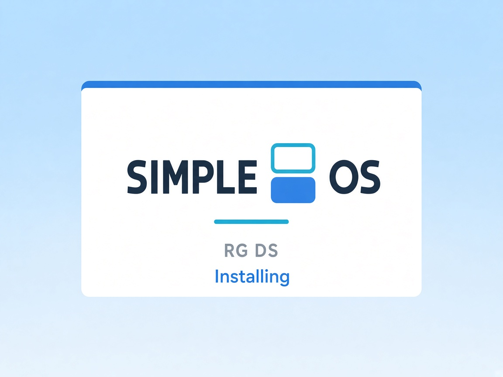
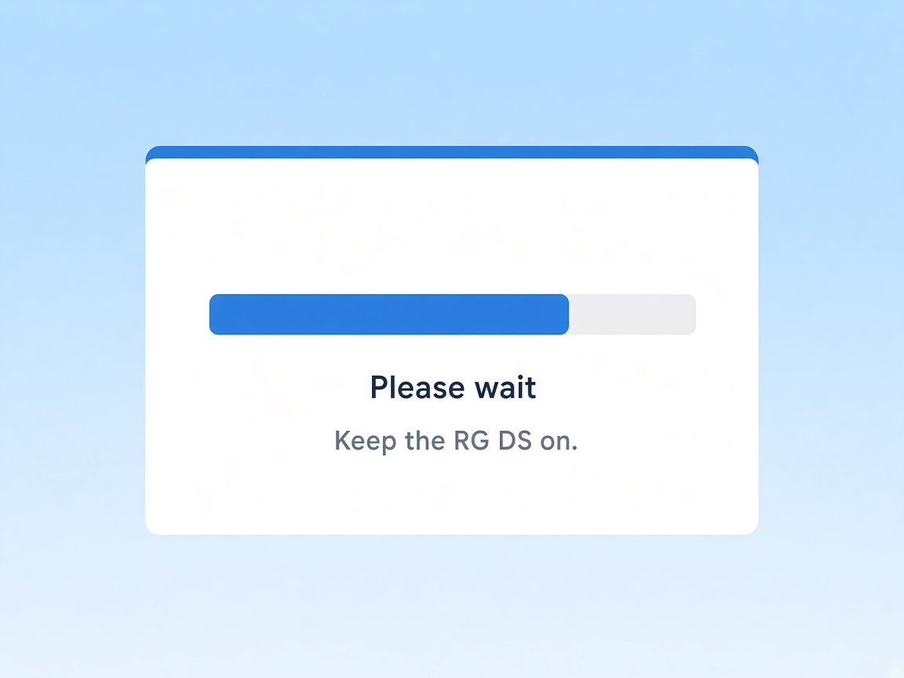

# Installing SimpleOS on Anbernic RG DS

SimpleOS does **not** replace the kernel and does **not** flash U-Boot.
It is an overlay on **official Anbernic Linux**. DraStic and Nintendo BIOS
files are not in this package: SimpleOS uses the copies already on the
firmware.

<p align="center">
  
</p>
<p align="center">
  
</p>

## What you need

1. Official [**Anbernic Linux**](https://win.anbernic.com/download/640.html) for RG DS: .
2. The release zip `releases/SimpleOS-RGDS-YYYYMMDD.zip` from this repository.

## Install

1. Flash an SD card with Anbernic's Linux firmware (using rufus or win32DiskImager)
2. Insert the SD card on your device and wait until the initial process is finished.
3. Eject the SD card and plug it back on your computer
4. Open the **user partition** (next to `Roms/`, `anbernic/`, …).
5. Extract the **contents** of the zip into the **root** of that partition:

   ```
   simpleos/
   simpleos/install/
   .simpleos_update/
   Roms/APPS/Install SimpleOS.sh
   README.txt
   ```

   If Windows asks to merge `Roms/`, confirm. Do not leave everything inside a
   nested folder named `SimpleOS-RGDS-…`.
6. Eject the card, insert it in the RG DS, power on.
7. In the Anbernic menu move to: **Applications → APPS** and then click on the *Install SimpleOS* script.
   SimpleOS splash screens appear on both displays. Do not power off.
8. When it finishes, the device reboots into SimpleOS
9. If the top screen doesn't come up: press **start → reboot**
10. Now you can add you roms the usual way or in *simpleos/games*
11. Enjoy!

Games go in `simpleos/games` and/or the stock NDS folder (`Roms/NDS`).

## Update

Replace `simpleos/` (or copy `system.zip` into `simpleos/`) and run
**Install SimpleOS** again. 

## Return to Anbernic Stock OS

Create the empty file `simpleos/userdata/boot_stock` and reboot.
Original logos are kept as `*.anbernic` next to the files SimpleOS replaced.

