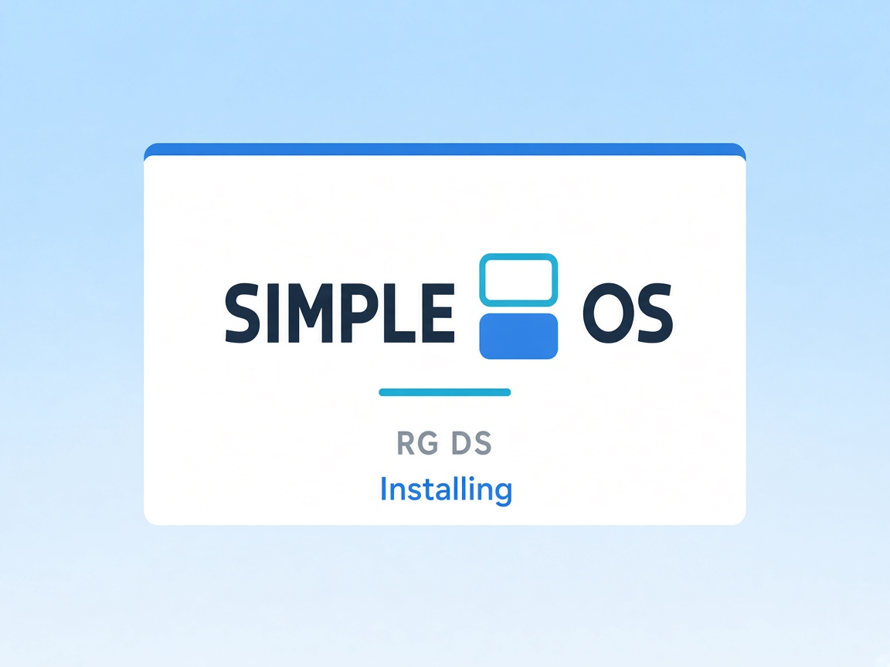
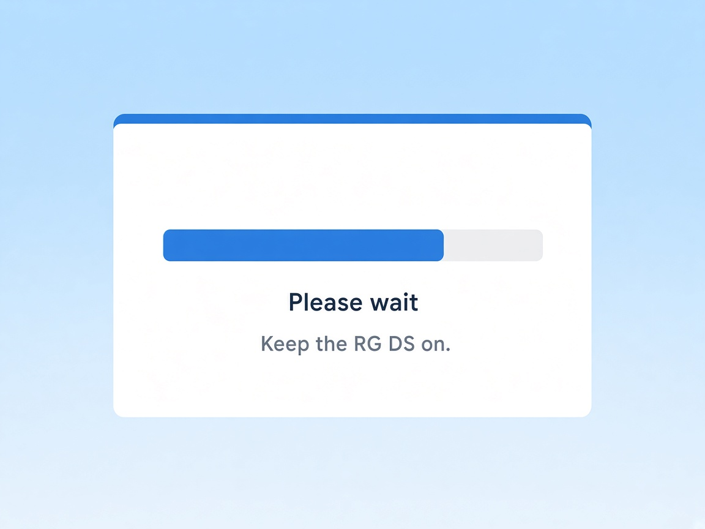

# Installing SimpleOS on Anbernic RG DS

SimpleOS does **not** replace the kernel and does **not** flash U-Boot.
It is an overlay on **official Anbernic Linux**. DraStic and Nintendo BIOS
files are not in this package: SimpleOS uses the copies already on the
firmware.

<p align="center">
  
</p>
<p align="center">
  
</p>

## What you need

1. Official [**Anbernic Linux**](https://win.anbernic.com/download/640.html) for RG DS: .
2. The release zip `releases/SimpleOS-RGDS-YYYYMMDD.zip` from this repository.

## Install

1. Flash an SD card with Anbernic's Linux firmware (using rufus or win32DiskImager)
2. Insert the SD card on your device and wait until the initial process is finished.
3. Eject the SD card and plug it back on your computer
4. Open the **user partition** (next to `Roms/`, `anbernic/`, …).
5. **Enable hidden folders** in your file explorer and extract the **contents** of the zip into the **root** of that partition. :

   ```
   simpleos/
   simpleos/install/
   .simpleos_update/
   Roms/APPS/Install SimpleOS.sh
   README.txt
   ```

   If Windows asks to merge `Roms/`, confirm. Do not leave everything inside a
   nested folder named `SimpleOS-RGDS-…`.
6. Eject the card, insert it in the RG DS, power on.
7. In the Anbernic menu move to: **Applications → APPS** and then click on the *Install SimpleOS* script.
   SimpleOS splash screens appear on both displays. Do not power off.
8. When it finishes, the device reboots into SimpleOS
9. If the top screen doesn't come up: press **start → reboot**
10. Now you can add you roms the usual way or in *simpleos/games*
11. Enjoy!

Games go in `simpleos/games` and/or the stock NDS folder (`Roms/NDS`).

## Update
### ⚠️If you are on version 1.0⚠️
1. Download version 1.1 from the release page
2. **Enable hidden folders** in your file explorer and extract the .zip file into **SimpleOS-RGDS-20260912**
3. Turn on WiFi and SSH on your device if they are off
4. Open WinSCP on your windows computer and login into your device by typing: **IP, user = root, password = root**
6. From SSH copy the *system* folder into */mnt/mmc/simpleos/* inside your device. Overwrite files if prompted
7. copy *main.sh* file into */mnt/mmc/simpleos/*. Overwrite files if prompted
8. In WinSCP oper the terminal (**SHIFT+CTRL+T**) and copy the following command
\
```
killall -9 simpleos drastic hangmon 2>/dev/null; for d in /proc/[0-9]*; do c=$(tr '\0' ' ' < $d/cmdline 2>/dev/null); case "$c" in *loop.sh*|*powerd.sh*|*bin/simpleos*) kill -9 ${d#/proc/} 2>/dev/null;; esac; done; setsid env -u SIMPLEOS_NOPOWEROFF -u SIMPLEOS_NORESUME -u SSH_CONNECTION -u SSH_CLIENT sh /mnt/mmc/simpleos/system/loop.sh >/tmp/simpleos.log 2>&1 < /dev/null &
```
9. SimpleOS should restart and you should see all the latest changes

### From version 1.1 onwards
**If you have WiFi access on your device**🛜
1. Turn on WiFi connection from the **Network settings** on your device
2. Open the **Settings** menu and select the **Update** option
3. Select **OTA**
4. If an update is available you will be asked to install the new update
5.  You will be asked if you want to install, click **A** to accept
6.  Wait for the installation process to finish
7. The device will now reboot into the updated version of SimpleOS


**If you don't have WiFi access on your device**❌🛜
1. Download the latest release of **SimpleOS** on [github](https://github.com/boorngos/SimpleOS/releases)
2. Turn off your console and insert the SD card inside your PC
4. Put the .zip with the latest release you download inside the *root* of your SD card
5. Put the SD card back onto your device and power it on
6. Open the Settings menu in **SimpleOS** and click on the **Update** option
7. Click on **Manual update**
8. You will be asked if you want to install, click **A** to accept
9. Wait for the installation process to finish
10. The device will now reboot into the updated version of SimpleOS

## Return to Anbernic Stock OS

Create the empty file `simpleos/userdata/boot_stock` and reboot.
Original logos are kept as `*.anbernic` next to the files SimpleOS replaced.

